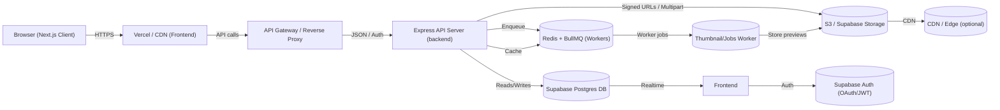
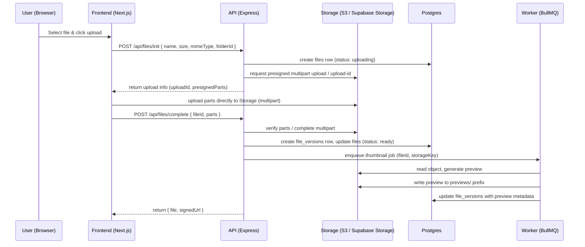
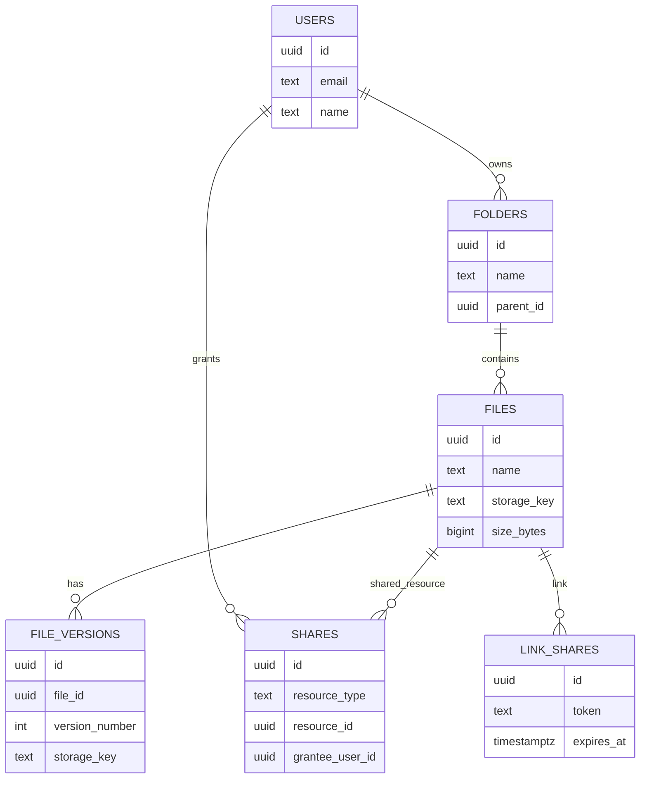

# 🌌 CloudFS — Cinematic Media Storage

[](https://nextjs.org/) [](https://expressjs.com/) [](https://supabase.com/) [](https://threejs.org/) [](https://greensock.com/)

[](https://cloud-fs-ten.vercel.app/)

[Live Demo — Open CloudFS](https://cloud-fs-ten.vercel.app/)

A cinematic, secure cloud file storage and sharing web app with polished animations, granular sharing controls, teams & permissions, and scalable storage. Think “Google Drive core” with a clean UI, strong access controls, and a focus on performance and visuals.

---

## Table of Contents
- [Introduction](#introduction)
- [Live Demo](#live-demo)
- [Features](#features)
- [Tech Stack](#tech-stack)
- [Supabase Authentication & Database Integration](#supabase-authentication--database-integration)
- [Architecture & Data Flow](#architecture--data-flow)
- [How I built this project](#how-i-built-this-project)
- [Challenges & How I Solved Them](#challenges--how-i-solved-them)
- [Performance & Optimizations](#performance--optimizations)
- [Setup & Launch (Local)](#setup--launch-local)
- [Contributing](#contributing)
- [License](#license)

---

## Introduction

CloudFS is a high-performance cloud drive focused on secure file storage and delightful UX. It provides:
- End-to-end encrypted file storage and versioning
- Folder hierarchy, search, and fast file previews
- Shareable expiring links and fine-grained permission controls (view/comment/edit)
- Team collaboration primitives and real-time sync cues
- Clean, premium UI backed by WebGL scenes for immersive visuals

This repository contains the full-stack code: a Next.js frontend (UI + WebGL/GSAP animations) and an Express backend (API, upload handling) with Supabase for auth and Postgres storage.

---

## Live Demo

Open the live app with the full animations and interactions:

> https://cloud-fs-ten.vercel.app/


Tip: Use Google OAuth (Supabase) to sign in and explore dashboard-only features.

---

## Features

- User authentication (Google OAuth + email)
- Folder and file CRUD with version history
- Drag & drop uploads with multipart support
- Fast in-browser previews (images, video thumbnails)
- Expiring share links for secure short-lived access
- Team and permission management (owner, admin, editor, viewer)
- Search with indexed metadata (file names, tags)
- Regional mirroring and resumable uploads (S3-compatible)
- Beautiful WebGL/GSAP-driven landing + dashboard visuals

---

## Tech Stack

- Frontend: Next.js 14, React 18, TypeScript, Tailwind CSS, GSAP, Three.js, React Query, Iconify
- Backend: Node.js, Express, TypeScript, PostgreSQL client (pg), JWT, bcrypt
- Hosting: Vercel (frontend), any Node hosting or container provider for backend
- Database & Auth: Supabase (Postgres + Supabase Auth)
- Storage: S3-compatible object storage (configurable), local multipart buffer for dev

---

## Supabase Authentication & Database Integration

CloudFS uses Supabase for authentication and as the primary Postgres database.

- Authentication
  - Supabase Auth handles Google OAuth and email/password sign-in.
  - Frontend uses the Supabase JS client to sign in and receives a session token.
  - Backend validates requests by verifying the JWT (Supabase session) and maps the user to local profiles in the app DB.

- Database schema (high level)
  - users (id, email, name, avatar, role, created_at)
  - folders (id, name, parent_id, owner_id, permissions, created_at)
  - files (id, name, folder_id, owner_id, size, mime_type, storage_key, versions, created_at)
  - file_versions (id, file_id, storage_key, size, checksum, created_at)
  - shares (id, file_or_folder_id, token, expires_at, permissions)

- Data flow
  - On upload, backend writes object to storage (S3 or local), creates a file + version row in Postgres, and emits a web-hook/Realtime event.
  - Permissions are stored on folders/files and evaluated on every API request. Share tokens are validated for expiration and permissions.

Security notes
- Never commit or expose Supabase anon/service keys in the repo. Use environment variables as shown in `.env.example`.
- Server-side verifies JWTs and checks DB permissions on each sensitive operation.

---

## Architecture & Data Flow

Below are clearer, developer-focused diagrams that summarize how CloudFS is organized at runtime, how uploads flow from client to storage, and the core data model. These diagrams are based on the backend spec and the frontend app structure in `frontend/src`.

### 1) System overview (high level)



Notes:
- Vercel serves the Next.js app and static assets; dynamic requests reach the API Gateway which routes to the Express backend.
- Supabase Auth is the identity provider; the frontend holds short-lived sessions and the backend verifies JWTs on every protected route.
- Storage is used for objects (files, previews); the API issues presigned URLs when appropriate so clients upload directly to the object store.
- Workers (BullMQ) process CPU-bound tasks (thumbnails, transcoding) and write artifacts back to storage and DB.

---

### 2) Upload flow (sequence)



Notes:
- The design keeps heavy bytes off the API by uploading directly to the storage provider.
- The backend maintains authoritative metadata and access control in Postgres.

---

### 3) Data model (ER sketch)



Notes:
- The schema follows the backend spec: folders use adjacency list (parent_id) and breadcrumbs are built with recursive queries.
- File versions are separate rows that point to immutable storage keys; the `files` table keeps the current active version pointer.

---

Developer checklist (for README / docs update)
- [x] Replace the simple mermaid diagram with the three diagrams above (system overview, upload sequence, ER sketch).
- [x] Add short explanatory notes and security/performance bullets.
- [ ] (Optional) Add PNG/SVG exports of the diagrams under `/docs/diagrams/` for viewers that don't render mermaid. I can commit generated images if you want.

If you want me to commit PNG/SVG renderings of these diagrams into `/docs/diagrams/` and update the README to reference them (improves GitHub render), reply and I will generate and push them.

---

## How I built this project

1. Planned core use-cases: secure file storage, sharing links, teams/permissions.
2. Designed a minimal normalized DB schema for files, versions, folders, and shares.
3. Implemented backend API (Express + TypeScript): authentication middleware, file CRUD, share token logic, and storage adapter interface.
4. Built the Next.js frontend using TypeScript and Tailwind CSS, implementing pages for landing, dashboard, files, and share views.
5. Added visuals using Three.js for 3D components (landing NIMBUS disk, dashboard storage orb) and GSAP for scroll/hover animations.
6. Integrated Supabase Auth for Google OAuth and session management.
7. Optimized: code-splitting heavy WebGL components, lazy-loading animation dependencies, and throttling expensive loops.

Development tips
- Work iteratively: start with plain UI and basic upload flow, then progressively enhance visuals.
- Encapsulate heavy graphics into React components and lazy-load them with Next.js dynamic imports.
- Use storage adapter pattern so you can switch between local filesystem and S3 with minimal changes.

---

## Challenges & How I Solved Them

1. Performance with Three.js scenes
   - Problem: Heavy WebGL scenes affected Largest Contentful Paint and CPU.
   - Solution: Code-split Three.js components (next/dynamic), cap frame rates for non-essential scenes, and reduce geometry detail for smaller viewports.

2. Large file uploads & resumability
   - Problem: Browser interruptions and large uploads.
   - Solution: Implement multipart upload with presigned URLs (S3) and a server-side resumable protocol for local/backends.

3. Real-time collaboration cues
   - Problem: Too many frequent DB polls caused rate issues.
   - Solution: Use Supabase Realtime where possible and switch to staggered polling with exponential backoff for fallback.

4. Secure short-lived share links
   - Problem: Prevent link abuse while keeping UX simple.
   - Solution: Signed tokens stored in DB with expiry checks and audit logs. Include permission-level scopes in the token payload.

---

## Performance & Optimizations
- Dynamic imports for heavyweight components (Three.js scenes)
- Smart polling intervals and Realtime usage
- Lazy-load fonts and non-critical assets
- Compress images and use responsive thumbnails
- Local caching for list views using React Query

---

## Setup & Launch (Local)

1. Clone the repo

```bash
git clone https://github.com/Chiranjeeb-Dash-Git/CloudFs.git
cd CloudFs
```

2. Backend

```bash
cd backend
cp .env.example .env
# Set your DATABASE_URL, JWT_SECRET, REFRESH_SECRET, CORS_ORIGIN, and S3 credentials
npm install
npm run dev
```

3. Frontend

```bash
cd frontend
cp .env.example .env.local
# Set NEXT_PUBLIC_API_URL, NEXT_PUBLIC_SUPABASE_URL, NEXT_PUBLIC_SUPABASE_ANON_KEY
npm install
npm run dev
```

4. Visit `http://localhost:3000` and sign in.

---

## Contributing

Contributions welcome! Please open issues or pull requests for bug fixes and features. Follow the code style and include tests where relevant.

---

## License

MIT — see LICENSE file.
